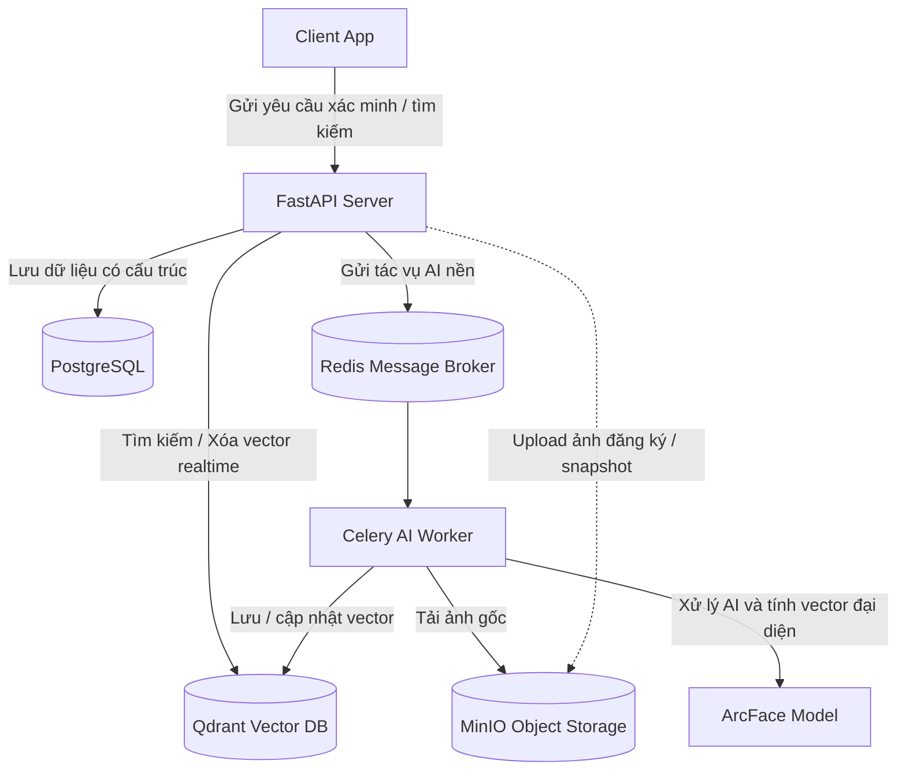

# DeepFace: Hệ thống kiểm soát ra vào cửa và chấm công bằng khuôn mặt

## 1. Use case
**Nhiệm vụ**: Hệ thống kiểm soát ra vào cửa và thực hiện chấm công cho nhân viên bằng khuôn mặt trong thời gian thực
```
Camera tại cửa chụp ảnh mặt nhân viên realtime 
-> API Backend FastAPI tiếp nhận
-> Trích xuất Embedding khuôn mặt (DeepFace - ArcFace Model)
-> Tìm kiếm khuôn mặt tương tự trong Vector DB (Qdrant) với ngưỡng score > 0.5
-> Nhận diện ID nhân viên 
-> Kiểm tra logic quyền truy cập (PostgreSQL):
     1. Tài khoản có Active (is_active) không?
     2. Cấp quyền theo thứ tự ưu tiên: cá nhân -> phòng ban
     3. Khung giờ: Giờ hiện tại nằm trong [allowed_start_time, allowed_end_time]
-> Trả về kết quả JSON: Kết quả match, employee_name, thông báo open_door và message cụ thể.
-> Lưu lịch sử nhận diện, ảnh snapshot và kết quả kiểm tra vào PostgreSQL (trạng thái SUCCESS/DENIED + lý do).
```
Hệ thống nhận diện khuôn mặt nhân viên thông qua webcam realtime. ✨ Chỉnh sửa lại câu này: Dự án được thiết kế theo yêu cầu đồ án: có frontend nhân viên, frontend quản trị viên, backend, database, object storage, vector database, queue, Nginx reverse proxy, Docker Compose, monitoring và tài liệu tái hiện.

## 2. Chức năng chính
   - **Điểm danh cho nhân viên**: Tiếp nhận ảnh từ camera cửa, nhận diện khuôn mặt, kiểm tra quyền truy cập nhiều lớp (trạng thái tài khoản, quyền cá nhân, quyền phòng ban, khu vực, khung giờ) rồi mới quyết định mở cửa.

   - **Đăng ký khuôn mặt cho nhân viên mới**: Hỗ trợ upload 1-3 ảnh cho một nhân viên, liên kết ảnh với dữ liệu nhân viên đã có. Celery Worker xử lý nền để: kiểm tra chất lượng ảnh (độ sáng, độ nhòe, số mặt), tính ArcFace embedding cho từng ảnh, và tính Average Embedding cuối cùng.

   - **Quản lý quyền truy cập cho nhân viên**: Cấp quyền truy cập theo cửa và khung giờ. Hỗ trợ cấp quyền riêng cho cá nhân hoặc kế thừa cho nguyên một phòng ban.

   - **Quản trị nhân viên**: Tìm kiếm nhân viên nâng cao, khóa/ mở tài khoản, thêm/ xóa hoàn toàn nhân viên

   - **Xem lịch sử điểm danh**: Tra cứu nhật ký ra vào thời gian thực (get_attendance_history), sắp xếp theo thời gian mới nhất, hiển thị trạng thái (SUCCESS/DENIED) và lý do từ chối cụ thể.

   - **Lưu trữ dữ liệu**: Lưu lịch sử vào PostgreSQL, lưu ảnh khuôn mặt gốc vào MinIO, lưu vector khuôn mặt vào Qdrant.

## 3. Kiến trúc

## 4. Yêu cầu môi trường
- Docker Desktop
- Docker Compose
- Phần cứng ✨
- Hệ điều hành: đã được thử nghiệm trên Windows
## 5. Model AI và Dataset

### 5.1. Model AI ✨
Hệ thống sử dụng thư viện DeepFace với cấu hình tối ưu để đảm bảo độ chính xác:
- Mô hình Nhận diện: ArcFace (trội hơn về khả năng nhận diện góc nghiêng và ánh sáng phức tạp, vector 512 dims).
- Mô hình Phát hiện khuôn mặt: retinaface (mạnh nhất để detect và align khuôn mặt).
- Normalization: "base".
- Chuẩn hóa Vector: Vector cuối cùng luôn được chuẩn hóa L2 100% trong VisionService.get_embedding
### 5.2. Dataset
   Dự án này sử dụng bộ dữ liệu ** [SCface (Surveillance Cameras Face Database)](https://scface.org/)** đã chỉnh sửa cho phù hợp dự án để thử nghiệm và đánh giá pipeline nhận diện khuôn mặt.
   
   Cấu trúc dữ liệu sử dụng trong dự án: ✨ % Chỉnh sửa thêm tên của file
   - Dữ liệu ảnh upload để làm ảnh gốc ✨ : Chứa ảnh của 130 nhân viên theo ba góc: góc chính diện, góc lệch trái và góc lệch phải
   - Sử dụng ảnh chụp từ 4 camera giám sát với 3 khoảng cách khác nhau để thực hiện luồng xác minh tại cửa để mô phỏng ảnh chụp realtime từ camera ở cửa.

```
Cấu trúc database
```

## 6. Cách chạy

## 7. Các luồng dữ liệu chính

### 7.1. Luồng xác minh
```
Quản trị viên gửi ảnh + tên cửa
-> backend FastAPI tiếp nhận, lưu tạm ảnh
-> DeepFace trích xuất vector khuôn mặt
-> Qdrant tìm kiếm vector tương tự (ngưỡng 0.5)
-> Nhận diện được ID nhân viên
-> Kiểm tra logic Quyền truy cập (db_service.check_access_permission):
     1. Nhân viên/Cửa có tồn tại không?
     2. Giờ hiện tại nằm trong khung giờ [allowed_start_time, allowed_end_time]?
-> Trả về kết quả match: True/False, message open_door
-> backend ghi log điểm danh (status: SUCCESS/DENIED, reason)
```
API chính
```
POST /attendance/identify?door_name=<string>
Content-Type: multipart/form-data
file=<image_binary>
```
### 7.2. Luồng đăng ký khuôn mặt nhân viên mới 

```
Admin nhập thông tin + upload 3 ảnh
-> backend FastAPI kiểm tra số lượng ảnh 
-> backend tạo hồ sơ nhân viên trong PostgreSQL (department_id)
-> backend upload ảnh gốc lên MinIO (S3 compatible storage)
-> backend gửi task Celery background "process_face_registration"
-> backend trả về thông tin nhân viên mới
-> Celery Worker tải ảnh từ MinIO
-> worker gọi DeepFace KIỂM TRA CHẤT LƯỢNG ảnh (quá sáng, nhòe, đúng 1 mặt)
-> worker trích xuất ArcFace vector, TÍNH AVERAGE VECTOR 
-> worker chuẩn hóa L2 vector cuối cùng
-> worker upsert average vector vào Qdrant (dùng ID nhân viên SQL làm ID point)
```
API chính
```
POST /employees/register
Content-Type: multipart/form-data
files=[<image1_binary>, <image2_binary>, ...]
full_name=<string>
employee_code=<string>
department_id=<int>
```
## 8. API chính
Attendance (Xác minh và điểm danh)
```
POST /attendance/identify
GET  /attendance/history
Tag: Employees (Quản lý Nhân viên)
code
Http
POST   /employees/register
GET    /employees/
GET    /employees/search
PATCH  /employees/{id}/status
PUT    /employees/{id}/permissions
DELETE /employees/{id}
```
Departments (Quản lý phòng ban và cửa ra vào)
```
GET  /departments/
POST /departments/
POST /departments/permissions
POST /departments/{dept_id}/quick-setup
```
Doors (Quản lý Cửa ra vào)
```
GET  /doors/
POST /doors/
```
System (Hệ thống)
```
GET /health
```
## 9. Monitoring và Backup


raw backend: https://graffiti-fit-error.ngrok-free.dev/docs
