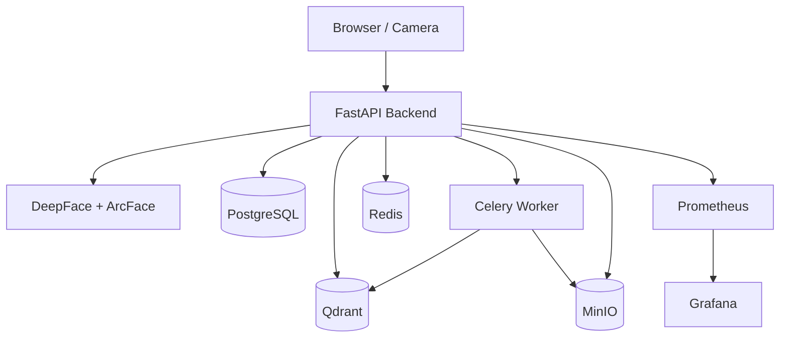

<p align="center">
  
</p>

<p align="center">
  
</p>

<p align="center">


</p>

---

# <span style="color: #1E3A8A;">DeepFace: Hệ thống kiểm soát ra vào cửa và chấm công bằng khuôn mặt</span>

## ✨ Highlights

- Real-time Face Recognition Attendance
- Multi-layer Access Control
- Vector Similarity Search with Qdrant
- Async Face Registration Pipeline
- Bulk Employee Import
- Realtime Dashboard via WebSocket
- Dockerized Microservice Architecture
- Monitoring with Grafana & Prometheus

---

## <span style="color: #059669;">1. Kiến trúc hệ thống</span>

<p align="center">
  
</p>



---

## <span style="color: #059669;">2. Tech Stack</span>

| Layer | Technologies |
|---|---|
| Frontend | React, Vite, TailwindCSS |
| Backend | FastAPI, SQLAlchemy |
| AI Engine | DeepFace, ArcFace, OpenCV |
| Vector Database | Qdrant |
| Database | PostgreSQL |
| Async Queue | Celery + Redis |
| Storage | MinIO |
| Monitoring | Grafana + Prometheus |
| Deployment | Docker Compose, GitHub Actions |

---

## <span style="color: #059669;">3. Chức năng chính</span>

### 🔐 Hệ thống điểm danh

- Nhận diện khuôn mặt realtime từ camera.
- Kiểm tra quyền truy cập nhiều lớp:
  - Trạng thái tài khoản.
  - Quyền cá nhân/phòng ban.
  - Khu vực cửa.
  - Khung giờ truy cập.
- Tự động ghi nhận SUCCESS / DENIED.

### 👨‍💼 Quản lý nhân viên

- Đăng ký khuôn mặt với 1–5 ảnh.
- Tìm kiếm nâng cao.
- Khóa / mở tài khoản.
- Quản lý quyền truy cập cửa.

### ⚡ Xử lý bất đồng bộ

- Celery Worker xử lý:
  - Face registration.
  - Bulk import.
  - Average embedding.
  - Background cleanup.

### 📊 Monitoring

- Grafana Dashboard.
- Prometheus Metrics.
- Realtime Logs.
- Health Check API.

---

## <span style="color: #059669;">4. Logic xử lý</span>

### <span style="color: #D97706;">4.1. Logic đăng ký khuôn mặt</span>

- Sử dụng nhiều góc ảnh để tạo Average Vector.
- Chuẩn hóa vector bằng L2 Normalization.
- Tự động loại bỏ:
  - Ảnh mờ.
  - Thiếu sáng.
  - Không có khuôn mặt.
- Hỗ trợ burst mode 10 ảnh liên tục.

### <span style="color: #D97706;">4.2. Logic điểm danh</span>

- Anti-spam Cooldown 60 giây.
- Unknown face chỉ log khi xuất hiện > 3.5s.
- Tự động phân loại:
  - Thành công.
  - Đúng giờ.
  - Muộn.
  - Từ chối.

### <span style="color: #D97706;">4.3. Logic quản trị</span>

- Bulk import hàng nghìn nhân viên.
- Quick setup phân quyền theo phòng ban.
- Dashboard realtime bằng WebSocket.
- Tự động cleanup log hằng ngày.

---

## <span style="color: #059669;">5. Model AI và Dataset</span>

### <span style="color: #D97706;">5.1. Model AI</span>

| Thành phần | Công nghệ |
|---|---|
| Face Detection | RetinaFace / OpenCV |
| Face Recognition | ArcFace |
| Embedding Size | 512-dim |
| Vector Similarity | Cosine Similarity |
| Vector Normalization | L2 Normalization |

### <span style="color: #D97706;">5.2. Dataset</span>

Sử dụng bộ dữ liệu **SCface** đã chỉnh sửa để đánh giá pipeline nhận diện khuôn mặt.

```text
database/
├── employees.json
└── Images/
    ├── mugshot_frontal_cropped_all/
    ├── surveillance_cameras_distance_1/
    ├── surveillance_cameras_distance_2/
    └── surveillance_cameras_distance_3/
```

---

## <span style="color: #059669;">6. Performance</span>

| Metric | Value |
|---|---|
| Face Embedding Size | 512-dim |
| Avg Recognition Time | ~180ms |
| Max Concurrent Cameras | 20+ |
| Recognition Accuracy | 98%+ |
| Vector Search Engine | Qdrant Cosine Similarity |

---

## <span style="color: #059669;">7. Yêu cầu môi trường</span>

- Docker Desktop
- Docker Compose
- CPU tối thiểu 4 cores
- RAM tối thiểu 12GB
- Hỗ trợ AVX2 khuyến nghị
- Đã thử nghiệm trên Windows
- Internet cho lần tải model đầu tiên

---

## <span style="color: #059669;">8. Tài khoản mặc định</span>

```yaml
Admin:
  username: admin
  password: admin123

User:
  username: user
  password: user123
```

---

## <span style="color: #059669;">9. Cách chạy hệ thống</span>

### 1. Clone project

```bash
git clone <your-repository>
cd deepface-attendance-system
```

### 2. Cấu hình môi trường

```bash
cp .env.example .env
```

### 3. Build và chạy

```bash
docker compose up -d --build
```

### 4. Các dịch vụ chính

```yaml
Frontend: https://deepface-azure.vercel.app
Backend Docs: http://localhost:8000/docs
MinIO: http://localhost:9001
Grafana: http://localhost:3000
Prometheus: http://localhost:9090
Qdrant: http://localhost:6333/dashboard
```

### 5. Xem log

```bash
docker compose logs -f backend
docker compose logs -f worker
```

### 6. Dừng hệ thống

```bash
docker compose down
```

---

## <span style="color: #059669;">10. Luồng dữ liệu chính</span>

### <span style="color: #D97706;">10.1. Luồng xác minh</span>

```text
Camera/Image
-> FastAPI Backend
-> DeepFace Extract Embedding
-> Qdrant Similarity Search
-> Access Permission Validation
-> Save Logs PostgreSQL
-> Save Snapshot MinIO
-> Redis Cooldown
-> Return Access Result
```

### API

```http
POST /api/v1/attendance/identify?door_name=<string>
Content-Type: multipart/form-data

file=<image_binary>
```

---

### <span style="color: #D97706;">10.2. Luồng đăng ký khuôn mặt</span>

```text
Admin Upload Images
-> PostgreSQL Create Employee
-> Upload Images MinIO
-> Push Task Redis Queue
-> Celery Worker Process
-> Face Validation
-> Extract Embeddings
-> Compute Average Vector
-> Save Qdrant
```

### API

```http
POST /api/v1/employees/register
Content-Type: multipart/form-data

full_name=<string>
employee_code=<string>
department_name=<string>
files=[<image1_binary>, <image2_binary>, ...]
```

---

## <span style="color: #059669;">11. Main API Endpoints</span>

<h2 align="center">
  
</h2>

<div align="center">

<table>
<tr>
<th>API Group</th>
<th>Endpoint</th>
<th>Description</th>
</tr>

<tr>
<td><b>Authentication</b></td>
<td>


<code>/api/v1/auth/login</code>

</td>
<td>Đăng nhập</td>
</tr>

<tr>
<td></td>
<td>


<code>/api/v1/auth/register</code>

</td>
<td>Tạo tài khoản</td>
</tr>

<tr>
<td></td>
<td>


<code>/api/v1/auth/me</code>

</td>
<td>Lấy thông tin tài khoản hiện tại</td>
</tr>

<tr>
<td><b>Attendance</b></td>
<td>


<code>/api/v1/attendance/identify</code>

</td>
<td>Nhận diện khuôn mặt và điểm danh</td>
</tr>

<tr>
<td></td>
<td>


<code>/api/v1/attendance/history</code>

</td>
<td>Xem lịch sử điểm danh</td>
</tr>

<tr>
<td></td>
<td>


<code>/api/v1/attendance/stats/monthly</code>

</td>
<td>Thống kê điểm danh theo tháng</td>
</tr>

<tr>
<td></td>
<td>


<code>/api/v1/attendance/export/excel</code>

</td>
<td>Xuất báo cáo Excel</td>
</tr>

<tr>
<td><b>Employees</b></td>
<td>


<code>/api/v1/employees/register</code>

</td>
<td>Đăng ký nhân viên và khuôn mặt</td>
</tr>

<tr>
<td></td>
<td>


<code>/api/v1/employees/</code>

</td>
<td>Lấy danh sách nhân viên</td>
</tr>

<tr>
<td></td>
<td>


<code>/api/v1/employees/{id}/status</code>

</td>
<td>Khóa/Mở tài khoản</td>
</tr>

<tr>
<td></td>
<td>


<code>/api/v1/employees/{id}/permissions</code>

</td>
<td>Cấp quyền truy cập cửa</td>
</tr>

<tr>
<td></td>
<td>


<code>/api/v1/employees/{id}</code>

</td>
<td>Xóa nhân viên</td>
</tr>

</table>

</div>

---

## <span style="color: #059669;">12. Monitoring và Backup</span>

### Monitoring

- Grafana Dashboard
- Prometheus Metrics
- Health Check API
- Realtime Logs
- SUCCESS / DENIED Tracking

```bash
docker compose logs -f backend
docker compose logs -f worker
```

### Backup

#### PostgreSQL

```bash
pg_dump -> .sql
```

#### Qdrant

```bash
POST /collections/face_embeddings/snapshots
```

#### MinIO

```bash
tar backup volume minio_data
```

---

## <span style="color: #059669;">13. Quản lý dữ liệu</span>

| Volume | Chức năng |
|---|---|
| postgres_data | User, Employee, Attendance Log |
| qdrant_storage | Face Embeddings |
| minio_data | Ảnh gốc và snapshot |
| deepface_models | Trọng số model |
| grafana_data | Dashboard Grafana |

---

## <span style="color: #059669;">14. Triển khai CPU</span>

- Ưu tiên OpenCV detection để giảm tải RAM.
- Worker tách biệt giúp tránh nghẽn API.
- Ngrok hỗ trợ HTTPS cho webcam browser.
- Hỗ trợ scale worker độc lập.

---

## <span style="color: #059669;">15. Demo</span>

<p align="center">
  
</p>

---

<p align="center">
  
</p>
